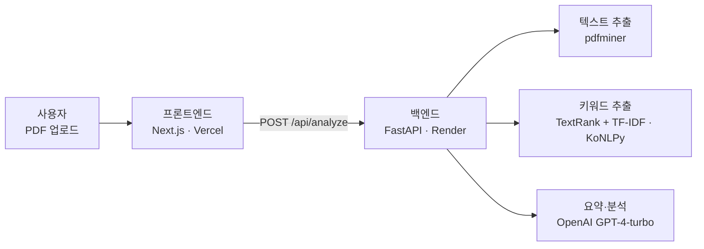

# PDF 문서 분석기 (PDF Document Analyzer)

## 배포 URL
- 서비스 링크: [https://xeona-ai-action-demo.vercel.app](https://xeona-ai-action-demo.vercel.app)
- API 엔드포인트: [https://xeona-ai-action-demo.onrender.com](https://xeona-ai-action-demo.onrender.com)

## 프로젝트 소개
PDF 문서를 업로드하면 AI가 자동으로 분석하여 주요 내용을 요약해주는 서비스입니다. 문서의 핵심 내용, 주요 키워드, 그리고 문맥 속에서의 키워드 사용을 한눈에 파악할 수 있습니다.

## 주요 기능
- **PDF 파일 업로드**: 드래그 앤 드롭 또는 클릭으로 간편하게 PDF 파일 업로드
- **문서 요약**: AI가 문서의 핵심 내용을 자동으로 요약
- **키워드 분석**: 주요 키워드 추출 및 출현 빈도 분석
- **문맥 파악**: 키워드가 사용된 문맥을 쉽게 확인
- **주요 내용 정리**: 문서의 핵심 포인트를 불릿 포인트로 정리
- **추천사항 제공**: 문서 내용을 바탕으로 관련 추천사항 제시

## 기술 스택
### 프론트엔드
- Next.js 13
- TypeScript
- Tailwind CSS
- Axios

### 백엔드
- FastAPI
- OpenAI API
- PDF 처리 라이브러리

## 🏗️ 아키텍처



## 로컬 개발 환경 설정
1. 저장소 클론
```bash
git clone https://github.com/JustDoIt-Lee/xeona-ai-action-demo.git
cd xeona-ai-action-demo
```

2. 프론트엔드 설정
```bash
cd frontend
npm install
npm run dev
```

3. 환경 변수 설정
```
# frontend/.env
NEXT_PUBLIC_API_URL=https://xeona-ai-action-demo.onrender.com
```

## 주요 개선사항
- 직관적인 파일 업로드 UI/UX
- 실시간 분석 상태 표시
- 모바일 친화적인 반응형 디자인
- 키워드 문맥 분석 기능 강화

## 배포 정보
- 프론트엔드: Vercel
- 백엔드: Render
